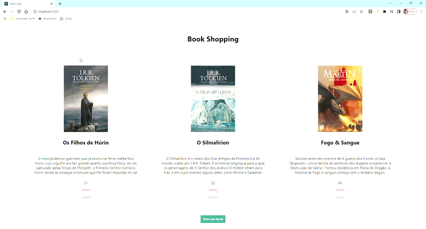

# Book Store

#

## Welcome! 👋

Thanks for checking out this front-end coding project.

**To do this challenge, I needed of HTML, SCSS and JavaScript. I needed to the libraries ReactJS and Redux. On the backend I used NodeJS, MySQL for the Database and Postman to make requests to the API.**.

## The project

The project aims to build this Book Store and make it as responsive and intuitive as possible.

The customer can:

- Preview the optimal layout for the website depending on your device's screen size
- See hover states for all interactive elements on the page
- Update the price of products
- Delete products
- Update product image and description

## Built with

- Javascript
- Flexbox
- [React](https://reactjs.org/) - JS library
- HTML
- SCSS
- Postman
- MySQL
- NodeJS
